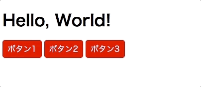

# レポジトリ内容

このレポジトリのmasterブランチの内容は `npx create-react-app js_exercise_for_react_2` を実行して、 `README.md` の修正と、完成形の画像を追加しただけです。

この課題は、Web白熱教室のReact課題その1「[【エクササイズ】CSSを反映させたReactコンポーネントを作る](https://tsuyopon.xyz/learning-contents/web-dev/javascript/react/js-exercise-for-react-1/)」の課題レポジトリになります。

## 課題

- 「課題をクリアするためのステップ」の内容を全て対応する
- 以下の完成形の画像と同じ見た目になるように `App.js` と `App.css` を実装する

## 完成形

### 課題をクリアするためのステップ

- [ ] srcディレクトリの中を `App.js` と `index.js` だけにする
- [ ] `App.js` と `index.js` が動くように修正する(不要なコードを削除する)
- [ ] srcディレクトリの中に `components` ディレクトリを作成する
- [ ] `components` ディレクトリの中に `Button` ディレクトリを作成する
- [ ] `Button`ディレクトリの中に `Button.jsx` と `Button.css` を作成して、上の完成形の画像のようなボタン1個のコンポーネントを実装する
- [ ] `App`コンポーネントと `関数コンポーネント` で作成する
- [ ] `Button`コンポーネントは `クラスコンポーネント` で実装する
- [ ] `Button` コンポーネントに表示する文字列は `props.children` で受け取れるようにする
    - 【注意】`Button` コンポーネントは `クラスコンポーネント` であるため、 `this` を使って、props値を扱う
- [ ] `npm start` を実行して、上に貼った「完成形」と同じ見ための表示がされれば完了

## レビュー依頼時の注意

- このプルリクをフォークして作業を開始しても構わないし、自分で `create-react-app` を使ってゼロから環境を作りあげるでも良い。
    - このプルリクをフォークして作業を開始して、最終的にレビューを依頼するときは以下の動画を参考にすること
        - [【動画解説】学習コンテンツの課題に取り組むときの注意点](https://tsuyopon.xyz/learning-contents/github/when-you-try-the-excercise-of-learning-contents/)
    - 自分で `create-react-app` を使ってゼロから環境を作ったものをレビューに投げる時は以下の動画を参考にしてプルリクを作成すること
        - [【動画解説】GitHubにレポジトリをPushするまでの流れ](https://tsuyopon.xyz/learning-contents/github/how-to-push-a-local-repository-to-the-github/)
        - [【動画解説】GitHubでプルリクエストを作るまでの流れ](https://tsuyopon.xyz/learning-contents/github/how-to-create-a-pull-request-on-github/)
- 一般的な開発フローに慣れるために、[git flow](https://qiita.com/KosukeSone/items/514dd24828b485c69a05)で作業を進めることをオススメする
    - masterブランチからdevelopブランチを作成する
    - developブランチからfeatureブランチを作成する
    - featureブランチで作業をして、プルリクエストを作成するときは、developブランチにマージされるように作成する

## 参考記事

課題をこなしていて、行き詰まったら以下の資料を参考にしていただければ解答にたどり着けるかと思います。

- Web白熱教室
    - [【React】コンポーネントの概念・種類を理解する](https://tsuyopon.xyz/learning-contents/web-dev/javascript/react/understand-react-components/)
    - [【React】コンポーネントで使うpropsの使い方を理解する](https://tsuyopon.xyz/learning-contents/web-dev/javascript/react/understand-props/)
    - [【React】関数コンポーネントの作り方](https://tsuyopon.xyz/learning-contents/web-dev/javascript/react/how-to-create-class-components/)
    - [【React】クラスコンポーネントの作り方](https://tsuyopon.xyz/learning-contents/web-dev/javascript/react/how-to-create-class-components/)
- プルリクエスト(`git flow` の開発スタイルで機能毎にブランチを分けて実装を進める際に参考になるページ)
    - https://github.com/tsuyopon-xyz/api_server_with_mock_db/pulls?q=is%3Apr+is%3Aclosed
